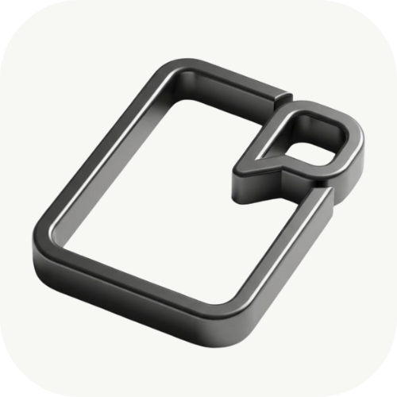
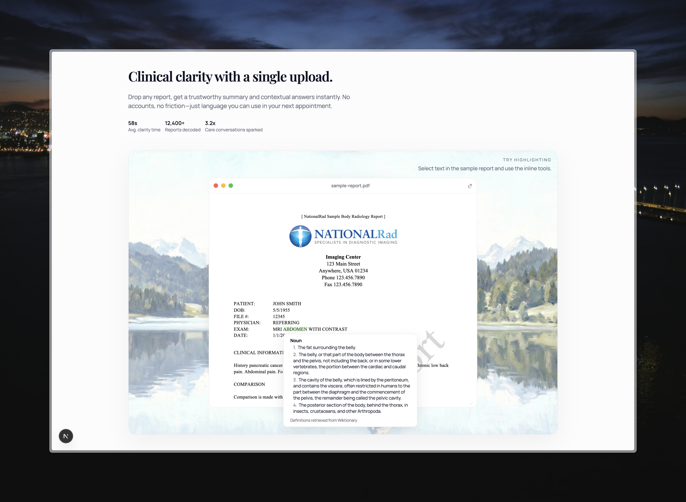
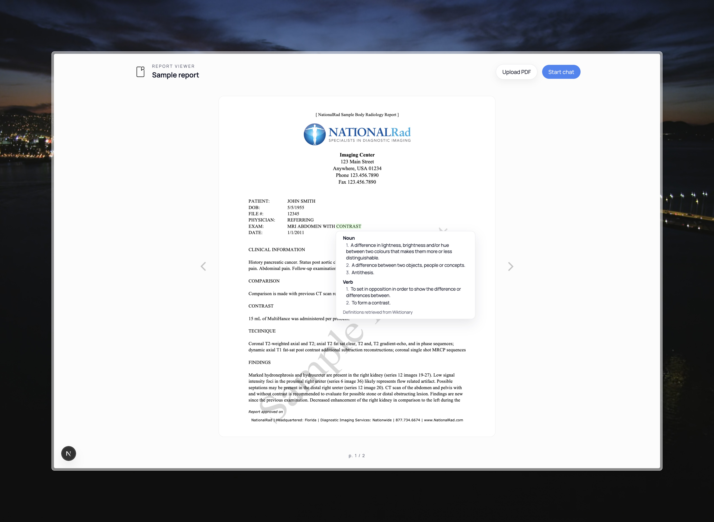
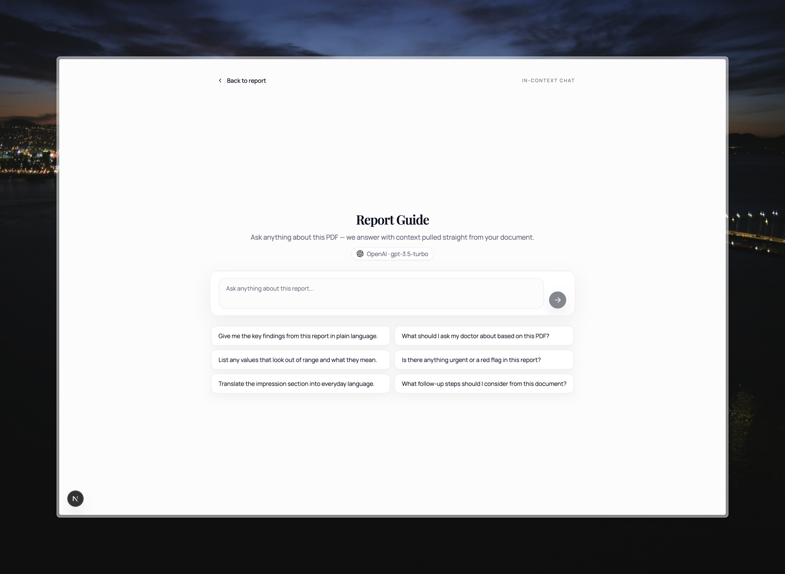

<div align="center">
  
</div>
<h1 align="center">Clear Health</h1>
<p align="center">Built after seeing cancer patients struggle to understand scans. this turns their reports into plain-language answers with highlight-to-define and RAG chat.</p>





## How It Works

1. **Upload**: Drag any PDF into the viewer; a sample report ships for instant play.
2. **Parse & chunk**: `pdf-parse` + LangChain splitters prepare pages for embedding.
3. **Embed & store**: `text-embedding-ada-002` vectors are namespaced per `fileKey` and upserted to Pinecone (`clearhealth` index).
4. **Retrieve & chat**: `/api/chat` streams grounded answers using the PDF context; responses stay citation-friendly.
5. **Inline tooling**: Highlight any phrase to **Define** (medical dictionaries), **Explain** (OpenAI, 30–50 words), or **Ask** (deep-link into chat).

## Quick Start

### Prerequisites

- Node.js 18+
- API keys: OpenAI, Pinecone, AWS S3

### Run locally

```bash
npm install
npm run dev
# visit http://localhost:3000
```

### Environment

Create `.env.local`:

```
OPENAI_API_KEY=...
PINECONE_API_KEY=...
```

## Architecture

### Frontend

- **Next.js 16 (App Router)** with a custom PDF chrome for inline highlight tools (`src/app/page.jsx`, `src/app/components/PDFLoader.jsx`, `src/app/pdf-viewer/page.jsx`).
- **ai/react** streaming chat UI with local persistence and starter prompts.
- **Framer Motion** + Tailwind for polished interactions.

### Backend

- **/api/upload-pinecone**: multipart PDF upload → parse → embed → upsert to Pinecone.
- **/api/chat**: RAG chat; injects Pinecone context before streaming OpenAI responses.
- **/api/openai-free-connection**: lightweight 30–50 word explainer for selected text.

## Product surface

- PDF viewer with highlight-aware tooltip actions.
- Inline definitions + plain-language explanations.
- Context-grounded chat with clipboard + feedback controls.
- Sample report auto-indexes on first load for a zero-setup demo.

## Inspiration

Cancer patients often receive multiple scans filled with unfamiliar terminology. This project exists to give them immediate clarity: definitions on tap, concise explanations, and citations from the report itself so they can have better conversations with their care team.
